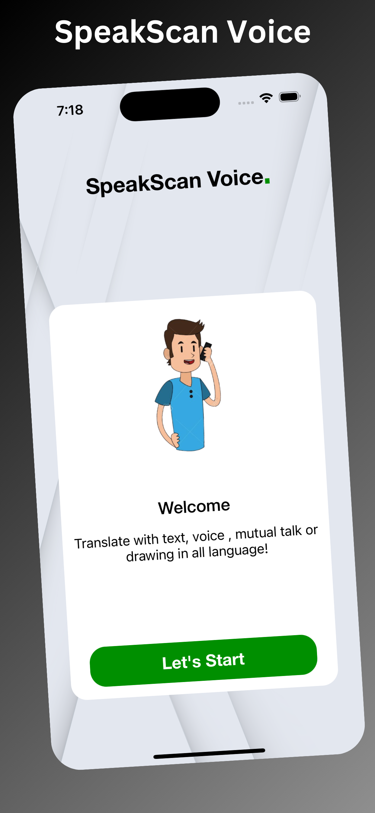

**SpeakScan Voice**

**Overview**

**SpeakScan Voice** is an innovative iOS app designed to break language barriers by combining powerful Optical Character Recognition (OCR) and Speech-to-Text technologies. Whether you need to convert text from an image or transcribe spoken words, SpeakScan Voice offers a seamless user experience for translating any language to another, making it a perfect tool for travelers, learners, and multilingual communication.

**Features**
Language Conversion: Supports translating text from any language to any other language, making it versatile for users around the world.

**OCR (Optical Character Recognition):** Capture and extract text from images, such as signs, documents, or menus, and instantly translate it into your preferred language.

**Speech-to-Text:** Speak into your device, and the app will transcribe your speech into text and translate it into the desired language in real-time.

**User-Friendly Interface:** Simple and intuitive design with clear controls, making language conversion, image text scanning, and speech transcription easy to use.

**Multi-Language Support:** Supports a wide range of languages for both text and speech conversion, giving users flexibility in communicating or understanding content across different languages.

Key Functionalities
**OCR Functionality:** Point your camera at text, take a picture, and the app will scan the image to detect text using OCR technology. The detected text can then be translated into a variety of languages.

**Speak-to-Text Conversion**: Use the microphone to speak in any language, and the app will convert your speech to text, which can then be translated instantly.

**Real-Time Translation:** After capturing or transcribing text, the app provides real-time translation into any language of your choice.

**Offline Mode: ** Translate previously scanned or spoken text even when offline (optional feature).

**Use Cases**
**Travel:** Instantly translate signs, menus, or documents in foreign countries using OCR or your voice.
**Learning:** Help language learners to understand and practice different languages with ease.
**Business:** Communicate with international clients or translate documents efficiently.
**Daily Use:** Use the app to understand text in a foreign language on the go, whether it's a product label or an instruction manual.

**Technologies Used**
**iOS: Swift programming language, UIKit framework**

OCR: Integrates Apple’s Vision framework for Optical Character Recognition (OCR) to detect and convert text from images.
Speech Recognition: Uses Apple’s Speech framework to convert voice input into text.
Translation: Integrates with language translation APIs (such as Google Translate API or similar) for accurate and real-time translation results.
How It Works
Scan Text: Use your camera to scan text from images. The OCR engine processes the image and extracts the text.
Speak and Convert: Press the microphone button, speak in any language, and the app will convert your speech to text.
Translate: Once the text (from OCR or speech) is captured, select your preferred language for translation, and the app will provide the translated text instantly.

**Getting Started**
**Clone the repository:**
bash
**Copy code**

git clone https://github.com/MoinJanjua/SpeakScan-Voice.git

Open the project in Xcode and install necessary dependencies (if any).
Run the app on the simulator or on a real device to test OCR, speech-to-text, and translation features.
This README description provides a comprehensive overview of what your app does, how it works, and what technologies are used. You can customize it further based on your app’s specific implementation.
SpeakScan Voice is an innovative iOS app designed to break language barriers by combining powerful Optical Character Recognition (OCR) and Speech-to-Text technologies. Whether you need to convert text from an image or transcribe spoken words, SpeakScan Voice offers a seamless user experience for translating any language to another, making it a perfect tool for travelers, learners, and multilingual communication.

**Download**
[Download SpeakScan Voice on the App Store](https://apps.apple.com/pk/app/speakscan-voice/id6683282440)

